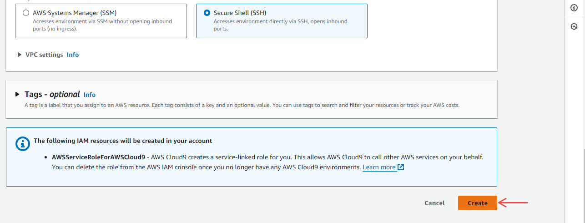
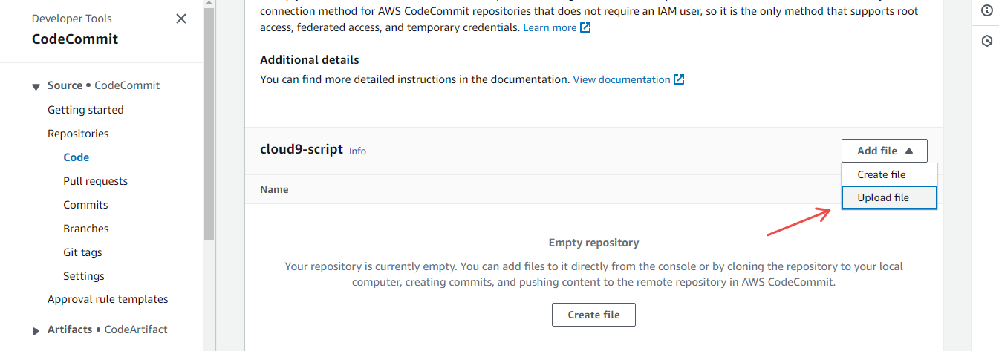

# Automated AWS Cloud9 Development Environment

## Challenge Overview

Create a template for initiating an AWS Cloud9 environment and a CodeCommit repository with setup scripts. This allows users to quickly establish an isolated development system in the cloud, customize it as needed, and easily dispose of it when done.

## Introduction

AWS Cloud9 is a cloud-hosted development environment offering the flexibility to swiftly create isolated environments in the cloud. While developers may have preferences for other IDEs, Docker, or virtual machines, Cloud9 provides the advantage of easily creating and discarding environments on-demand.

## Prerequisites

- Familiarity with AWS CloudFormation for IaC.
- Fundamental understanding of AWS CodeCommit.
- Basic of understanding of Cloud9. Check out the [Jared's blog post](https://www.trek10.com/blog/i-buy-a-new-work-machine-everyday).

## Challenge Steps

### 1. Cloud9 Initial Exploration

If you haven't used Cloud9 before, set up an "**EC2**" environment through the AWS console.

To create a Cloud9 environment using the AWS console, follow the steps below:

1. On AWS, navigate to the Cloud 9 console and click on the **Create Environment** button.

   

2. Fill in the form, specifying the **Name**, **Instance type** and **Platform**.

   

   

   

3. After which, click on the **Create** button.

   

4. After the Cloud9 environment is provisioned, you can open the IDE.

   

5. Under the **Cloud9 IDE** tab, click on **Open** to view the IDE.

   

6. Explore the Cloud9 IDE. Observe the similarities and differences between your conventional IDE and this one.

   

   

> **NOTE:** Remember to destroy the environment and associated resources when finished (e.g., the IAM role).

### 2. Simple Template

To create a Cloud9 environment via CloudFormation, you'll need a template in either JSON or YAML.

To use the CloudFormation console to provision a Cloud9 IDE, follow the steps below:

1. Navigate to the CloudFormation console and click on the **Create stack** button.

   

2. Under the **Template is ready** option, select **Upload a template file**.

   You can choose to use the other options, but this tutorial uploads the file from the local machine

3. Click on **Choose file** button to upload a file then click the **Next** button.
4. The second step to creating a cloudformation stack will be automatically populated with information from the uploaded file. Just specify the **stack name** and click on the **Next** button.

   

   

5. Click through the other steps as they are optional and submit the form.
6. This will begin the creation of CloudFormation stack and Cloud9 resource.

   

7. After the stack creation, navigate to the Cloud9 console to view the IDE.

   

> **NOTE:** Make sure to edit the `CloudFormation.yml` file using the [AWS::Cloud9::EnvironmentEC2](https://docs.aws.amazon.com/AWSCloudFormation/latest/UserGuide/aws-resource-Cloud9-environmentec2.html) syntax.

### 3. Add a Setup Script

Develop a script for setting up prompts and installing preferred tools on a new system.

The `setup_environment.yml` file is an Ansible script that installs Ansible, installs or upgrades packages and configures Git on your system.

### 4. Have Cloud9 Check Out Your Script at Startup

To have Cloud9 check out your script at startup, follow the steps below:

1. Navigate to the CodeCommit console and click on the **Create repository** button

   

2. Input the necessary repository information and click on the **Create** button.

   

3. This will redirect you to include the files for the repository. Click on the **Add file** button and select the **upload file** option.

   

4. Upload the file by clicking the **Choose file** button.

   

5. Add the commit message and upload file.

   

After you finish creating the repository, you can now add the repository to your CloudFormation template.

To add the repository, edit the following section on your file:

```yaml
RepositoryName:
  Description: CodeCommit Repository Name
  Type: String
  Default: "Cloud9-script"
```

Upon starting the Cloud9 environment, the specified script will be available on the instance.


> **NOTE:** Make sure to delete the s3 bucket created by CloudFormation.

## Conclusion

This project guides users through the process of creating an automated AWS Cloud9 development environment.

By leveraging CloudFormation and CodeCommit, developers can quickly spin up, customize, and dispose of isolated environments, enhancing efficiency and resource management.

For more projects like this, visit the [Cloud Resume Challenge repository](https://github.com/cloudresumechallenge/projects/tree/main/projects).
